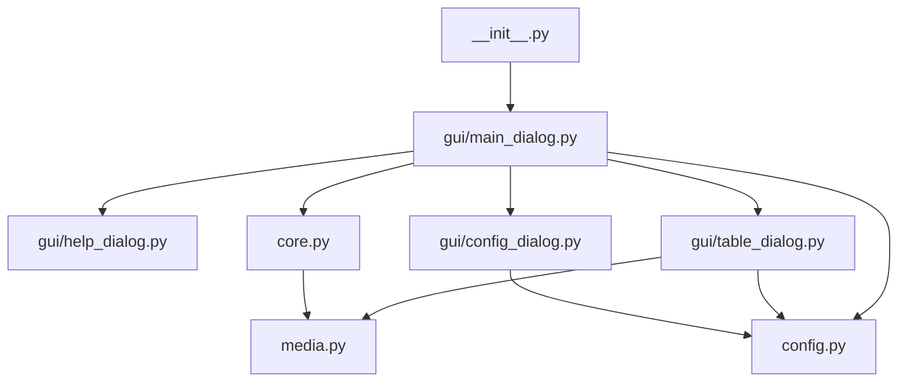
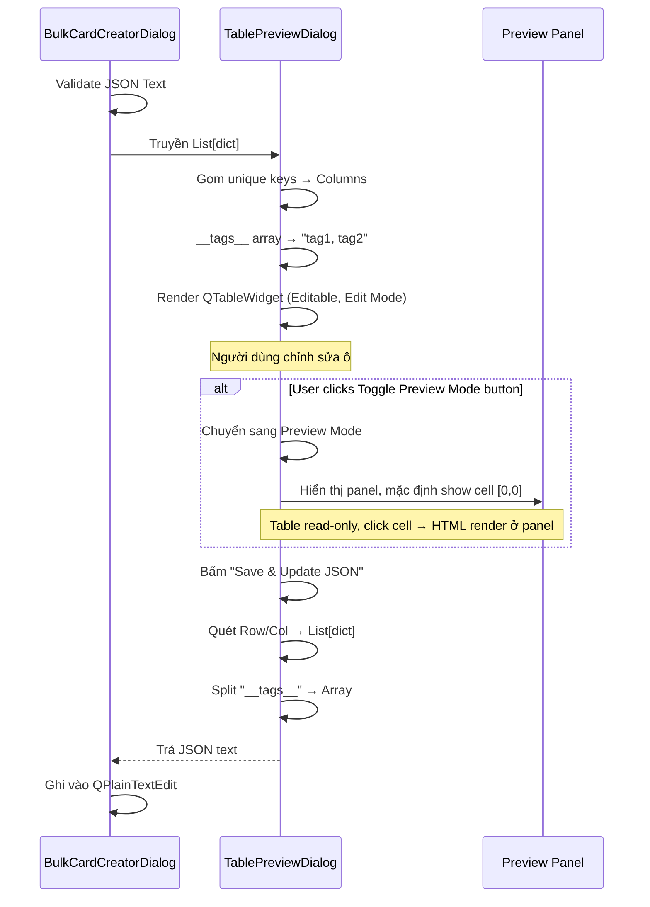
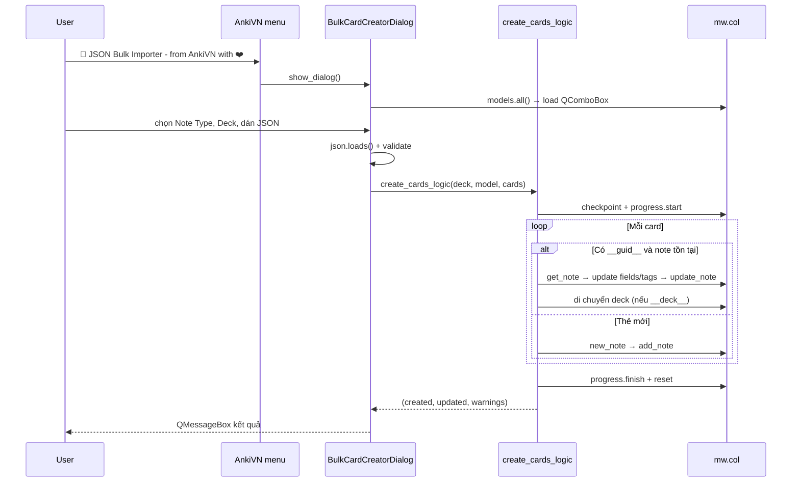

# 🚀 JSON Bulk Importer - from AnkiVN with ❤️ — Blueprint

Tài liệu mô tả addon Anki để tra cứu khi chỉnh sửa hoặc mở rộng. Cập nhật lần cuối: 2026-04-07.

---

## 1. Tổng quan

| Mục | Chi tiết |
|-----|----------|
| Tên addon | 🚀 JSON Bulk Importer - from AnkiVN with ❤️ (`meta.json`) |
| Stack | **Thuần Python** (`aqt`, `anki`) — Qt widgets qua `aqt.qt` |
| Kiến trúc | **Modular** — tách thành nhiều module theo Separation of Concerns |
| Dữ liệu | Collection Anki (`mw.col`) — SQLite do Anki quản lý |
| Menu | **AnkiVN** (ngang hàng Tools) → "🚀 JSON Bulk Importer - from AnkiVN with ❤️" |

### Cấu trúc thư mục (Modular)

```text
1082727791/
├── __init__.py           ← Entry point: Menu AnkiVN + lazy import show_dialog
├── config.py             ← Quản lý user_config.json (media mappings + presets)
├── media.py              ← Smart Media Downloader + [media:...] resolver
├── core.py               ← Logic Anki DB: create_cards_logic, create_new_model
├── gui/
│   ├── __init__.py
│   ├── help_dialog.py    ← HelpDialog (hướng dẫn song ngữ English / Tiếng Việt)
│   ├── config_dialog.py  ← MediaConfigDialog (cấu hình field Image/Audio)
│   ├── table_dialog.py   ← TablePreviewDialog (bảng editable + Pre-fetch)
│   └── main_dialog.py    ← BulkCardCreatorDialog (giao diện chính)
├── history/              ← Lưu record JSON cho mỗi batch Create/Update
├── user_config.json      ← Lưu media mappings, ngôn ngữ, và presets
├── hold.py               ← Legacy (webview/bridge cũ), không import
```

### Sơ đồ phụ thuộc (không có circular import)



---

## 2. Entry point — Menu AnkiVN → Dialog

- `get_or_create_ankivn_menu()` quét menubar tìm menu "AnkiVN"; nếu addon khác đã tạo thì dùng lại, nếu chưa thì tạo mới (chèn trước Help).
- `QAction("🚀 JSON Bulk Importer - from AnkiVN with ❤️")` → `show_dialog()` → `BulkCardCreatorDialog(mw).exec()`

---

## 3. Giao diện (Qt thuần)

`BulkCardCreatorDialog(QDialog)`:

| Widget | Vai trò |
|--------|---------|
| `QHBoxLayout` header | Chứa Language switcher và nút Help ở đầu dialog để người dùng tìm hướng dẫn nhanh |
| `QGroupBox` Setup | Nhóm Note Type, Deck, Smart Sync, và nút Field Media Config để thao tác cốt lõi rõ ràng hơn |
| `QGroupBox` Tools | Nhóm Preset, Generate GUID, Add Deck into JSON, History, và Write GUID back into JSON |
| `QGroupBox` JSON Input | Nhóm các thao tác Import/Export/Copy Prompt và vùng nhập JSON |
| `QGroupBox` Actions | Nhóm các nút View as Table, Create / Update, Close |
| `QComboBox` (Note Type) + `QPushButton` ⚙️ Field Media Config | Chọn Note Type; bấm ⚙️ mở `MediaConfigDialog` để đặt field nào là Image/Audio |
| `QComboBox` (Deck, editable) + `QPushButton` New Deck | Chọn deck hoặc bấm "＋ New Deck" tạo mới; mặc định "Bulk Card Creator" |
| `QComboBox` (Smart Sync) | Chọn field để match note cũ (thay thế GUID); "None" = chỉ dùng `__guid__` |
| `QComboBox` (Preset) + `QPushButton` Save/Load Preset | Lưu và nạp nhanh cấu hình note type/deck/smart sync/JSON payload |
| `QPushButton` Help | Mở hộp thoại hướng dẫn song ngữ với 2 tab English / Tiếng Việt |
| `QPushButton` Sinh GUID | Điền `__guid__` cho các card còn thiếu trong JSON hiện tại, không ghi đè GUID đã có |
| `QPushButton` History | Mở thư mục `history/` để xem các record batch JSON đã lưu |
| `QPushButton` 📌 Add Deck into JSON | Thêm `__deck__` cho các card còn thiếu trong JSON hiện tại dựa vào deck đã chọn, không ghi đè `__deck__` đã có |
| `QCheckBox` Write GUID back to JSON | Sau khi batch hoàn tất, ghi `__guid__` vào JSON để tái nhập hoặc Smart Sync lần sau |
| `QPushButton` Import JSON | Mở `QFileDialog` chọn file `.json` từ máy → đọc nội dung vào `QPlainTextEdit` |
| `QPushButton` Export JSON | Lưu nội dung `QPlainTextEdit` ra file `.json` qua `QFileDialog` |
| `QPushButton` Copy Prompt for AI | Sinh prompt chuẩn cho ChatGPT/Claude, tự đồng bộ với cấu hình media (dặn AI trả URL trực tiếp cho field Image/Audio) |
| `QPlainTextEdit` | Dán JSON Array. Khi Note Type thay đổi, vùng này sẽ tự động điền mẫu JSON lấy từ các field (điền sẵn `insert_your_content_here`). |
| `QPushButton` View as Table | Validate JSON → mở `TablePreviewDialog` (xem / chỉnh sửa dạng bảng) |
| `QPushButton` Create/Update | Gọi `create_cards_logic()` trực tiếp, không qua bridge |
| `QPushButton` Close | Đóng dialog |

Khi bấm **View as Table**:
1. Parse & validate JSON (phải là list of dict, non-empty).
2. Nếu lỗi cú pháp → `QMessageBox` yêu cầu sửa trước.
3. Nếu hợp lệ → mở `TablePreviewDialog` truyền `List[dict]`.
4. Khi người dùng bấm "Save & Update JSON" → ghi đè `QPlainTextEdit`.

Khi bấm Create/Update:
1. Parse JSON bằng `json.loads()` — báo lỗi `JSONDecodeError` ngay (`QMessageBox`).
2. Validate: phải là list of dict.
3. Gọi `create_cards_logic(deck_name, note_type_name, cards)`.
4. Hiển thị kết quả: bao nhiêu thẻ tạo mới, bao nhiêu cập nhật, cảnh báo (nếu có).

Khi bấm Save Preset:
1. Validate JSON hiện tại (phải parse được và là Array).
2. Nhập tên preset qua `QInputDialog`.
3. Lưu dữ liệu vào `user_config.json` qua `save_preset(...)`.
4. Refresh danh sách preset ngay trên UI.

Khi bấm Load Preset:
1. Chọn preset trong combobox.
2. Nạp lại Note Type, Deck, Smart Sync field và JSON text.
3. Nếu deck chưa có trong combo thì tự thêm vào danh sách.

Khi bấm Sinh GUID:
1. Addon parse JSON hiện tại thành `List[dict]`.
2. Chỉ card nào chưa có `__guid__` mới được gán `guid64()`.
3. Card đã có `__guid__` sẽ giữ nguyên.
4. JSON được ghi ngược lại vào editor ngay để người dùng kiểm tra trước khi import.

Khi bấm Help:
1. Mở dialog riêng `HelpDialog`.
2. Dialog có 2 tab: English và Tiếng Việt.
3. Nội dung mô tả ngắn gọn luồng dùng setup, tools, JSON input, table preview, create/update, và các mẹo meta keys.

Khi bấm Add Deck into JSON:
1. Addon parse JSON hiện tại thành `List[dict]`.
2. Chỉ card nào chưa có `__deck__` mới được thêm deck đã chọn.
3. Card đã có `__deck__` sẽ giữ nguyên.
4. Tên deck lấy từ deck combobox (mặc định "Bulk Card Creator").
5. JSON được ghi ngược lại vào editor ngay để người dùng kiểm tra.
6. Mục đích: chuẩn bị JSON có `__deck__` sẵn để tất cả cards import vào deck phù hợp.

Khi bấm History:
1. Hiển thị dialog với thông báo "History saved to: {path}" và hai nút:
   - **"Open Folder History"** (ActionRole): Mở thư mục `history/` trực tiếp trên máy (Windows: `os.startfile`, Linux/Mac: hiện path để người dùng tự mở).
   - **"Close"** (RejectRole, nút mặc định): Đóng dialog mà không mở thư mục.
2. Mỗi batch Create/Update thành công đều tạo một file JSON riêng trong thư mục này.
3. Record có thể dùng để audit, debug, hoặc nhập lại khi cần.

Khi bật Write GUID back to JSON:
1. Sau `Create / Update`, addon giữ lại JSON input thay vì xóa sạch.
2. Mỗi card được backfill `__guid__` từ note vừa tạo hoặc note đã khớp.
3. JSON kết quả có thể dùng lại cho lần import tiếp theo để Smart Sync bám GUID.

---

## 3b. Table Preview — `TablePreviewDialog`

`TablePreviewDialog(QDialog)` — popup hiển thị JSON dạng bảng, cho phép chỉnh sửa trực tiếp hoặc xem HTML render.

| Widget | Vai trò |
|--------|---------|
| `QPushButton` 🔍 Toggle Preview Mode | Chuyển đổi giữa Edit Mode (editable, hiển thị text) và Preview Mode (read-only, render HTML) |
| `QTableWidget` | Hiển thị card dưới dạng lưới; **Edit Mode**: editable bằng double-click; **Preview Mode**: read-only, click cell để xem HTML preview |
| `QTextBrowser` (preview_panel) | Xuất hiện trong Preview Mode, dưới table; hiển thị HTML rendered của cell đang click |
| `QPushButton` Paste from Excel | Dán dữ liệu TSV từ Excel/Sheets (dòng đầu = tiêu đề, còn lại = data) |
| `QPushButton` ⬇️ Pre-fetch Media | Tải thử media cho các cột Image/Audio; Xanh = OK, Đỏ = lỗi (tooltip hiện nguyên nhân) |
| `QPushButton` Save & Update JSON | Chuyển bảng → JSON, ghi vào `QPlainTextEdit` gốc |
| `QPushButton` Cancel | Đóng popup, không thay đổi gì |

### Hai chế độ xem (Toggle Preview Mode)

**Edit Mode (mặc định)**:
- Table widget có thể edit được (double-click cell để sửa text).
- Preview panel ẩn.
- User có thể điều chỉnh nội dung JSON tự do.

**Preview Mode**:
- Table widget chỉ đọc (không có edit trigger).
- Preview panel hiện ở dưới table (max-height: 100px).
- Click cell bất kỳ → HTML content được render ở preview panel.
- Mục đích: xem được các HTML tags, bold, italic, ảnh nhúng, v.v. mà không cần save ra file khác.
- Mặc định hiển thị preview của cell [0, 0] khi vào mode.

### Thuật toán sinh cột (Columns)
- Duyệt tất cả card, gom **unique keys**.
- Meta-keys (`__guid__`, `__deck__`, `__tags__`) xếp đầu, sau đó các trường nội dung.

### JSON → Table (populate)
- Mỗi card = 1 hàng. Mỗi key = 1 cột.
- `__tags__` (mảng) → join thành chuỗi `"tag1, tag2"` để dễ sửa.
- Các value phức tạp (dict/list khác) → `json.dumps`.

### Table → JSON (save)
- Lặp từng hàng/cột, đọc text từ `QTableWidgetItem`.
- Bỏ qua ô trống.
- `__tags__`: tách chuỗi bằng dấu phẩy → `["tag1", "tag2"]`.
- Kết quả: `json.dumps(cards, indent=2, ensure_ascii=False)`.



---

## 4. Logic lõi — `create_cards_logic`

### Input

```python
create_cards_logic(
    deck_name: str,
    note_type_name: str,
    cards: List[dict],
    match_field: Optional[str] = None,
    media_mappings: Optional[dict] = None,
) -> Tuple[int, int, List[str]]  # (created, updated, warnings)
```

### Meta keys đặc biệt trong mỗi card (học hỏi CrowdAnki)

| Key | Ý nghĩa |
|-----|---------|
| `__guid__` | GUID để nhận diện thẻ cũ (`select id from notes where guid = ?`) |
| `__deck__` | Tên deck đích — di chuyển thẻ vào đây (thay vì deck mặc định) |
| `__tags__` | String hoặc Array string — thêm tag vào thẻ |

Các meta key được `pop` ra trước khi gán field.

### Smart Sync Engine

Khi `match_field` được chỉ định (VD: `"Front"`):
- Trước vòng lặp, xây cache `{field_value: note_id}` bằng SQL: `SELECT id, flds FROM notes WHERE mid = ?`.
- Parse `flds` (chuỗi phân tách bởi `\x1f`) để lấy giá trị field tại index tương ứng.
- Trong vòng lặp, nếu không tìm được note bằng GUID → fallback tìm trong cache theo nội dung field.

### Auto Media Resolver

Regex `\[media:(.*?)\]` quét tất cả field values. Nếu khớp:
- URL (`http://`, `https://`) → `urllib.request.urlretrieve` tải về `collection.media`.
- Local path → `shutil.copy2` copy vào `collection.media`.
- Tự sinh tên file unique (`bulk_<uuid>.ext`).
- Thay thế bằng `` (ảnh) hoặc `[sound:...]` (audio).

### Luồng xử lý mỗi card

1. Pop `__guid__`, `__deck__`, `__tags__`.
2. Resolve `[media:...]` tags trong tất cả field values (backward compat).
3. **Field-based Media**: nếu `media_mappings` có field là `image`/`audio` → gọi `smart_download_media()` tự động tải URL/copy file.
4. Nếu có `__guid__` → query `notes.guid` trong SQLite.
4. Nếu không tìm được bằng GUID + Smart Sync bật → tìm theo field content trong cache.
5. **Nhánh UPDATE** (note đã tồn tại):
   - Auto-merge: chỉ ghi đè field có tên trùng khớp.
   - Field có trong Anki mà không có trong JSON → **giữ nguyên** (personal fields).
   - Field có trong JSON mà không có trong Anki → bỏ qua + cảnh báo.
   - Tags → `note.tags.append()` (không xóa tag cũ).
   - `col.update_note(note)`.
   - Nếu `__deck__` → di chuyển cards sang deck mới.
4. **Nhánh CREATE** (note chưa tồn tại hoặc không có guid):
   - `col.new_note(model)` → gán field + guid (nếu có) + tags.
   - `col.add_note(note, deck_id)`.

### Anki UX

- `mw.checkpoint("Bulk Card Creator")` — cho phép **Ctrl+Z** hoàn tác toàn bộ.
- `mw.progress.start/update/finish` — thanh tiến trình chống đơ UI.

---

## 5. Tạo Note Type mới — `create_new_model`

Nếu `note_type_name` chưa tồn tại trong collection:
- Tạo model mới với field `Front` + các key từ `cards[0]` (bỏ qua key bắt đầu bằng `__` và key trùng `"Front"`).
- Template: mặt hỏi `{{Front}}`, mặt đáp ghép `{{ key }}` mỗi field.

---

## 6. Sơ đồ trình tự



---

## 7. JSON mẫu

### Tạo mới đơn giản (không GUID)

```json
[
  {"Front": "Hello", "Back": "Xin chào"},
  {"Front": "Goodbye", "Back": "Tạm biệt"}
]
```

### Tạo + cập nhật với GUID, deck, tags

```json
[
  {
    "__guid__": "abc123",
    "__deck__": "Vietnamese::Vocabulary",
    "__tags__": ["chapter1", "important"],
    "Front": "Hello",
    "Back": "Xin chào"
  },
  {
    "__guid__": "def456",
    "Front": "Goodbye",
    "Back": "Tạm biệt (updated)"
  }
]
```

### Sử dụng Auto Media Resolver (Legacy — tag-based)

```json
[
  {
    "Front": "Cat",
    "Back": "Con mèo [media:https://example.com/cat.jpg]"
  },
  {
    "Front": "Phát âm",
    "Back": "[media:C:\\Users\\Downloads\\pronunciation.mp3]"
  }
]
```

### Sử dụng SOTA Media Engine (Field-based)

Nếu đã cấu hình Field Media Config: `ImageField` = Image, `AudioField` = Audio:

```json
[
  {
    "Front": "Cat",
    "Back": "Con mèo",
    "ImageField": "https://example.com/cat.jpg",
    "AudioField": "https://example.com/cat_meow.mp3"
  }
]
```

Addon sẽ tự tải ảnh/audio về `collection.media` và thay thế URL bằng `` / `[sound:...]`.

### Sử dụng History

Sau mỗi batch Create/Update, addon ghi một file JSON trong `history/` với summary (note type, deck, match_field, counts, warnings) và payload cards cuối cùng. Người dùng có thể mở thư mục này từ nút History trên dialog chính.

### Sử dụng Preset

Preset lưu tại `user_config.json` với schema:

```json
{
  "presets": {
    "My Preset": {
      "note_type": "Basic",
      "deck": "Bulk Card Creator",
      "match_field": "Front",
      "json_text": "[{\"Front\":\"...\",\"Back\":\"...\"}]"
    }
  }
}
```

Mục đích: tái sử dụng nhanh bộ cấu hình thao tác mà không cần chọn lại từng phần.

### Sử dụng GUID backfill

Nếu bật tùy chọn "Write __guid__ back into JSON after create/update", sau batch JSON đầu vào sẽ được cập nhật thêm `__guid__` cho từng card, kể cả card được khớp bằng Smart Sync thay vì GUID sẵn có.

### Sử dụng Sinh GUID

Nút "Sinh GUID" dùng khi muốn chuẩn bị JSON có sẵn `__guid__` trước batch import. Nút này chỉ thêm GUID cho object còn thiếu key `__guid__`, không chạm vào GUID đã có.

---

## 8. File quan trọng

| File | Vai trò |
|------|---------|
| `__init__.py` | Entry point: Menu AnkiVN + `show_dialog()` (lazy import) |
| `config.py` | `_get_config()`, `_save_config()`, `get_media_mappings()`, `get_presets()`, `save_preset()` |
| `media.py` | `smart_download_media()`, `resolve_media_in_text()`, constants |
| `core.py` | `create_cards_logic()`, `create_new_model()` |
| `gui/main_dialog.py` | `BulkCardCreatorDialog` — giao dien chinh |
| `gui/table_dialog.py` | `TablePreviewDialog` — bảng editable + Pre-fetch Media |
| `gui/config_dialog.py` | `MediaConfigDialog` — cấu hình field Image/Audio |
| `user_config.json` | Cấu hình media field + ngôn ngữ + presets |
| `meta.json` | Tên addon, version Anki |
| `hold.py` | Legacy (webview/bridge cũ), không import |
| `docs/PROJECT_BLUEPRINT.md` | Tài liệu này |

---

## 9. Ràng buộc & lưu ý

- **Import:** Chỉ dùng `from aqt.qt import ...` — không `pip install PyQt`.
- **Tài liệu PyQt** (Riverbank): chỉ để tham khảo tên lớp/hành vi; nguồn chuẩn là [addon-docs Anki](https://addon-docs.ankiweb.net/).
- **Test thủ công:** Cài addon → restart Anki → mở profile có collection → AnkiVN → 🚀 JSON Bulk Importer - from AnkiVN with ❤️.
- **Undo:** Một lần Ctrl+Z hoàn tác toàn bộ batch (nhờ `mw.checkpoint`).
- **Media:** Hai cơ chế song song:
  1. **Field-based (SOTA):** Bấm ⚙️ Field Media Config → chọn field là Image/Audio. Sau đó chỉ cần dán URL vào field đó, addon tự tải về. Cấu hình lưu vĩnh viễn trong `user_config.json`.
  2. **Tag-based (legacy):** Cú pháp `[media:URL_or_PATH]` vẫn hoạt động cho backward compat.
- **Pre-fetch Media:** Trong Table Preview, bấm "⬇️ Pre-fetch Media" để tải thử → ô Xanh = OK, ô Đỏ = lỗi (tooltip hiện nguyên nhân). Nếu không pre-fetch, media sẽ auto-fetch khi bấm Create/Update.
- **Preset:** Save Preset chỉ lưu khi JSON hợp lệ (Array); Load Preset có thể khôi phục cả JSON payload để chạy batch lặp lại nhanh.

---

## 10. Lịch sử thay đổi kiến trúc

| Phiên bản | Kiến trúc |
|-----------|-----------|
| Cũ (trước 2026-03-28) | `QDialog` + `AnkiWebView` nhúng React; bridge `GCFJ:...` qua chuỗi JSON; UI build bằng Vite+React+TS |
| Mới (2026-03-28) | **Thuần Python Qt** — bỏ Webview/JS/GCFJ; gọi trực tiếp `mw.col`; thêm GUID update, auto-merge, deck/tag, Undo |
| View as Table (2026-03-28) | Thêm `TablePreviewDialog` — xem/chỉnh sửa JSON dạng bảng editable; auto-convert `__tags__` array ↔ chuỗi dấu phẩy |
| UI Polish (2026-03-28) | Native Minimize/Maximize qua `WindowFlags` (cả 2 Dialog); nút "＋ New Deck"; Import/Export JSON qua `QFileDialog` |
| SOTA Features (2026-03-28) | Smart Sync Engine (match by field, không cần GUID); AI Prompt Generator; Magic Paste (Excel TSV → Table); Auto Media Resolver (`[media:...]`) |
| SOTA Media Engine (2026-03-28) | Field-based Media Config (`MediaConfigDialog` + `user_config.json`); Smart Media Downloader (HTTP Content-Type detection); Pre-fetch trong Table Preview (highlight Xanh/Đỏ + tooltip); Auto-fetch trong `create_cards_logic`; AI Prompt tự đồng bộ media config |
| Modular Architecture (2026-03-28) | Tách `__init__.py` (1127 dòng) thành 7 module: `config.py`, `media.py`, `core.py`, `gui/config_dialog.py`, `gui/table_dialog.py`, `gui/main_dialog.py`. Entry point chỉ còn menu + lazy import. Không circular imports. |
| Preset Workflow (2026-04-07) | Thêm Save/Load Preset trong `main_dialog.py`; lưu `note_type`, `deck`, `match_field`, `json_text` vào `user_config.json` qua `config.py` (`get_presets`, `save_preset`); i18n key mới cho `vi/en`. |
| Toggle Preview Mode (2026-04-07) | Thêm nút "🔍 Toggle Preview Mode" trong `TablePreviewDialog`; chuyển đổi giữa Edit Mode (editable, text-only) và Preview Mode (read-only, render HTML với `QTextBrowser`); click cell trong Preview Mode hiển thị HTML rendered ở panel dưới. |
| History Dialog UX (2026-04-07) | Thay vì tự động mở folder, sau batch hiển thị dialog với hai nút: "Open Folder History" (user chọn mở) và "Close" (đóng mà không mở); cho phép user kiểm soát xem có mở history folder hay không. |
| Help Dialog & Grouped UI (2026-04-07) | Tái bố cục `main_dialog.py` thành các nhóm Setup / Tools / JSON Input / Actions và thêm nút Help mở `HelpDialog` song ngữ English/Vietnamese để người dùng tra cứu toàn bộ tính năng. |
| Add Deck into JSON (2026-04-07) | Thêm nút "📌 Add Deck into JSON" trong `main_dialog.py`; cho phép user bulk thêm `__deck__` vào cards trong JSON dựa vào deck hiện được chọn; chỉ thêm cho cards chưa có `__deck__`, không ghi đè values sẵn có. |
